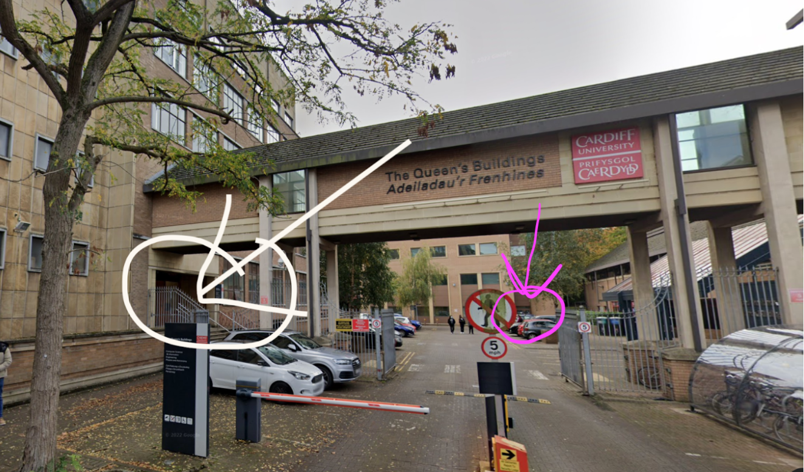
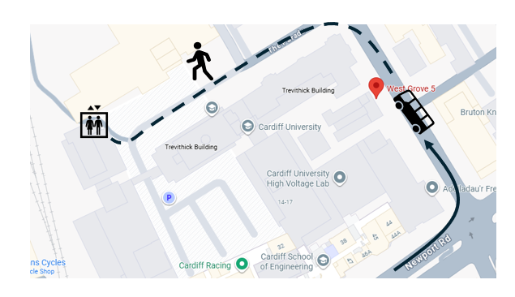

# UK SKAO Science Committee Town Hall 2025

- [Location](#location)
- [Programme](#programme)
- [Local Information](#local-information)
- [Code of Conduct](#code-of-conduct)
---
## Registration
To register for either in-person or online attendance, please follow the link [here](https://www.eventbrite.co.uk/e/annual-uk-skao-science-committee-town-hall-17th-18th-november-2025-tickets-1541380072289?aff=oddtdtcreator).

## Location
The Town Hall will be located in the WX3.07 room of the School of Physics and Astronomy at Cardiff University.

You can find the School on google maps [here](https://maps.app.goo.gl/M9uK2BpVGZbLjqp19).

The WX (West Extension) building itself is [here](https://maps.app.goo.gl/Hs3gNAJCHgnJKisx7) and you can find further information about Accessibility within the building [here](https://www.accessable.co.uk/cardiff-university/cathays-park-campus/access-guides/west-building-extension).

The building is just outside the city centre (less than five minutes from the edge), so is readily accessible by public transport and walking. If you require parking a limited amount is available, with details at the bottom of [this page](https://www.cardiff.ac.uk/visit/accessibility/cathays-park-campus/queens-buildings).

On the Monday morning there will be both signs and people guiding you as to how to get to the room.

Marked in white is entrance to the department (for registration), in pink is entrance to the WX building (for the talks):

Route from the nearest bus stop to the WX building:

## Programme
Please note the details of this programme are subject to change! Speakers with a * will be online.
### Monday 17th November
| Start time | Title | Speaker | Duration |
|---|---|---|---|
| 10:30 | **Arrival & Registration** (with coffee \& pastries) |  | 30 min |
| 11:00 | Welcome / Logistics | Ian Harrison | 5 min |
| 11:05 | UK SKAO Science Committee - ECR intro | ECR sub-committee | 5 min |
| 11:10 | SKAO Construction Overview | Stuart Whittley | 20 + 5 |
| 11:35 | SKAO Science Overview | Nichol Cunningham | 20 + 5 |
| 12:00 | UK SKA Regional Centre - update | Rob Beswick / Louise Chisholm | 20 + 5 |
| 12:25 - 14:00 | **Lunch** (food self-organised, coffee provided) |  | 1 hr 30 min |
| 14:00 | Overview of Görlitz meeting | Philippa Hartley | 20 + 5 |
| 14:25 | Engaging with Industry | Carol Watts | 20 + 5 |
| 14:50 | Panel Q&A | All previous speakers | 40 min |
| 15:30 | **Break** (with coffee \& Welsh cakes) |  | 30 min |
| 16:00 | Precision cosmology with MeerKLASS 21cm intensity mapping | Steve Cunnington | 15 + 5 |
| 16:20 | The Planet-Earth Building-Blocks Legacy e-MERLIN Survey: a pathfinder on where planets grow | Jane Greaves | 15 + 5 |
| 16:40 | Low-frequency-selected Fast Radio Burst Host Galaxies Candidates | Yuzhu Sun | 15 + 5 |
| 17:00 | **End** |  |  |

### Tuesday 18th November
| Start time | Title | Speaker | Duration |
|---|---|---|---|
| 08:45 | **Arrival** (with coffee \& pastries) |  | 35 min |
| 09:20 | Unraveling the puzzle of "super-thin" spiral galaxies with MeerKAT | Timothy Davis | 15 + 5 |
| 09:40 | From MIGHTEE–HI to SKA: Connecting Galaxy Evolution and HI Cosmology | Anastasia Ponomareva* | 15 + 5 |
| 10:00 | Briefing on the SKA Data Challenge 3b: a Bayesian inference pipeline for EoR science | Yuchen Liu | 15 + 5 |
| 10:20 | LOFAR Imaging Observations of Sub-second Solar Radio Bursts | Daniel Clarkson | 15 + 5 |
| 10:40 | **Break** (with coffee \& Welsh cakes) |  | 30 min |
| 11:10 | The MeerKAT International GHz Extragalatic Exploration (MIGHTEE) Continuum Survey | Catherine Hale | 15 + 5 |
| 11:30 | Ultra-wideband study of giant pulse emitters | Patrick O'Neill | 15 + 5 |
| 11:50 | Investigating HI source finding strategies | Michalina Maksymowicz-Maciata | 15 + 5 |
| 12:10 | First Steps Towards Systematic Zeeman Measurements of Interstellar Magnetic Fields with SKA Precursors | Kate Pattle | 15 + 5 |
| 12:30 - 14:00 | **Lunch** (food self-organised, coffee provided) |  | 1 hr 30 min |
| 14:00 | The SARAO MeerKAT Galactic Plane Survey | Mark Thompson | 15 + 5 |
| 14:20 | Probing the EoR transition to late-time large-scale structure with neutral hydrogen | Jamie Incley | 15 + 5 |
| 14:40 | Modelling the Impact of Primary Beam Asymmetries on SKAO HI Intensity Mapping | Tobias Russell | 15 + 5 |
| 15:00 | Towards a robust cosmological data analysis pipeline for neutral hydrogen intensity mapping with SKAO | Zhaoting Chen | 15 + 5 |
| 15:20 | Recovering the Coupled Treatment of Redshift-Space Distortions and the Lightcone Effect after Diffuse Foreground Removal | Jen Feron | 15 + 5 |
| 15:40 | Wrap up |  | 35 min |
| 16:15 | **End** |  |  |

## Local Information
### Accommodation
The venue is located just to the East of Cardiff city centre, less than five minutes walk from the main shopping street. As such there are many hotels throughout the city at all budget levels within walking distance.

### Arrival
If you are arriving on the day, Cardiff Central train station is around a twenty minute walk from the venue. You can also take the bus numbers 57/52/58 or take the short train transfer to Cardiff Queen Street station, which is less than five minutes walk away.

### Food and Drink
As well as the usual chains Cardiff city centre has a thriving independent food and drink scene and you can find a list of recommended places [here](https://www.google.com/maps/d/u/0/edit?mid=1Z-K3QlnnRexcsHMl1_EkTq2LOI4hY4A&usp=sharing). If you aren't sure what you want then [Church Street](https://maps.app.goo.gl/vTQiCPYMxWSbMEsU7) and the surrounding arcades has a high density of good options.

Of the things which are open on Mondays my top picks would be:

**Lunch**:
- [Cardiff Market](https://maps.app.goo.gl/Y2bQ1T9kkpkQkEip6) (many `street food' options)
- [Falafel Corner](https://maps.app.goo.gl/ErttzxJypr4EMJkE8)
- [McSims](https://maps.app.goo.gl/EhVhQG4MSPydDqrd8) (Maltese savoury pastries)
- [Donald's Coffee \& Pies](https://maps.app.goo.gl/Ss39zEyWorBc42jf7)
- [Pettigrew Bakery](https://maps.app.goo.gl/citwpHJEaQgDcq9X8)
- [Bike Lock Cafe](https://maps.app.goo.gl/GCrykVkoPvtng6Q49)
- [Oat & Bean Cafe](https://maps.app.goo.gl/z6ZJZawiup5YYBaY9) (vegan)

**Evening**:
- [Bacareto](https://maps.app.goo.gl/xxt51CdUv1WWiV9FA)
- [Bar 44](https://maps.app.goo.gl/9uFofddAoBQTB9WN7)
- [Curado](https://maps.app.goo.gl/f5ruZ2sRZna5jFJN6)
- [Nighthawks](https://maps.app.goo.gl/DA27jaqMHt7Wjhcs9) (drinks and cheese toasties)
- [Daffodil](https://maps.app.goo.gl/YKYPURGhjJT2ohvb8)
- [QBAO noodles bar](https://maps.app.goo.gl/risvbqDpBS4gsY7p9)
- [Mad Dog](https://maps.app.goo.gl/6qQhbKhyUJEvyqXg6) (drinks only Monday)
- [Flute & Tankard](https://maps.app.goo.gl/KRXjHP7Hk4kAn1qL7) (drinks only)
- [Scaredy Cats](https://maps.app.goo.gl/6Nn33XbkrztdLNAF6) (drinks and snacks only -- great selection of board games)

## Code of Conduct
The UKSKAOSC Town Hall is intended for networking and collaboration as well as learning. We value the participation of everyone and want all attendees to have an enjoyable and fulfilling experience. Accordingly, all attendees are expected to show respect and courtesy to other attendees throughout the event.

We would like to make it very clear: the event will be a harassment-free environment for everyone, regardless of gender, sexual orientation, disability, physical appearance, body size, race, nationality, religion. We do not tolerate harassment of attendees in any form.

- Harassment includes offensive verbal comments related to gender, sexual orientation, disability, physical appearance, body size, race, religion, sexual images in public spaces, deliberate intimidation, stalking, following, harassing photography or recording, sustained disruption of talks or other events, inappropriate physical contact, and unwelcome sexual attention.
- All communication given by speakers, meeting organisers and attendees should be appropriate for a professional audience including people of many different backgrounds. Sexual language, jokes and imagery is not appropriate for any event.
- Be kind to others. Do not insult or put down other attendees.
- Behave professionally. Remember that harassment and sexist, racist, or exclusionary jokes are not appropriate.

Participants asked to stop any harassing behaviour are expected to comply immediately. Attendees violating these rules may be asked to leave the event at the sole discretion of the meeting organisers.
We hope you have a wonderful time at the Town Hall.

This code of conduct is adapted from http://software-carpentry.org/conduct.html
